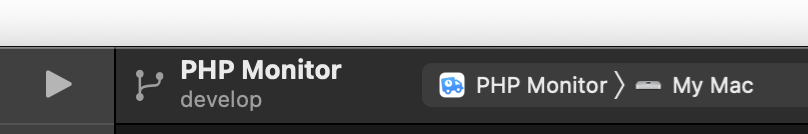

# DEVELOPER README

## ✅ Linting

This project uses the [SwiftLint](https://github.com/realm/SwiftLint) linter. You must install it and can run it like so:

```
swiftlint
```

It also automatically runs when you try to build the project. You'll get a warning if `swiftlint` is not installed, though. You can attempt to automatically fix issues:

```
swiftlint --fix
```

## 📦 Swift Packages

Starting from PHP Monitor 7.1, the app now uses various first-party package dependencies.

The following package dependencies are in use:

* [`NVAppUpdater`](https://github.com/nicoverbruggen/NVAppUpdater)
* [`NVAlert`](https://github.com/nicoverbruggen/NVAlert)

You may need an internet connection to download these dependencies, or you can also clone the dependencies and include them manually.

## ⚙️ Preferences

You can find the persisted configuration file in `~/Library/Preferences/com.nicoverbruggen.phpmon.plist`

These values are cached by the OS. You can clear this cache by running:

```
defaults delete com.nicoverbruggen.phpmon && killall cfprefsd
```

## 🔧 Homebrew

To test with an upcoming version of Homebrew:

    brew developer on
    brew update
    
To return to the stable version:

    brew developer off
    brew update

## 🔧 Build instructions



### PHP Monitor

If you'd like to build PHP Monitor yourself, you need:

* Xcode (usually the latest version)

Once you have downloaded this repository, open `PHP Monitor.xcodeproj`, and you should be able to build the app for your system by pressing Cmd-R. This will create a debug build. (If Xcode complains about code signing, you can turn it off.)

**Important**: The updater now gets automatically built and included as part of the main target.

If you'd like to create a production build, choose "Any Mac" as the target and select Product > Archive.

## 🔀 Concurrency (Swift 6)

PHP Monitor is built in **Swift 6 language mode** with **main-actor-by-default** isolation. The
following are set at the project level (so every target inherits them):

```
SWIFT_DEFAULT_ACTOR_ISOLATION = MainActor
SWIFT_STRICT_CONCURRENCY      = complete
SWIFT_APPROACHABLE_CONCURRENCY = YES
```

`SWIFT_VERSION` is `6.0` for the app, the Self-Updater and the **Unit Tests**
target. The **UI Tests target is intentionally kept at `5.0`** — see the note under UI tests
below. Please do not flip it without reading that note.

### What "main-actor-by-default" means when writing code

Every type, function and closure is **`@MainActor` unless you say otherwise**. That is the right
default for UI and app-model code and it is why most of the app "just works" on the main thread.
You only reach for `nonisolated` in specific, deliberate cases:

* **Leaf services that can be called off the main actor** — the shell, filesystem and command
  layers (`RealShell`, `RealFileSystem`, `RealCommand`, `Paths`, and their protocols) are
  `nonisolated` so any isolation can call them. Their blocking calls are guarded by
  `warnIfBlockingOnMainThread(...)` in debug builds.
* **Pure value types & helpers** — value types with no main-actor state (e.g. `SystemContext`,
  `DetectableService`, `BrewCommandProgress`), and pure functions/extensions (`url(...)`,
  `TimeInterval` math, `String.localized`, `Date.fromString`, etc.). Mark these `nonisolated`
  (and `Sendable` where they cross isolation) so they can be used from any context.
* **Orchestration** — e.g. the `BrewCommand` family is `nonisolated` and only `await`s onto
  `@MainActor` for UI updates (`MainMenu`, `WindowManager`). Note the pitfall below: being
  `nonisolated async` does **not** move work off the main actor by itself.

### Blocking work must go through `runBlocking` (or `@concurrent`)

Because `SWIFT_APPROACHABLE_CONCURRENCY` enables `NonisolatedNonsendingByDefault`, a plain
`nonisolated async` function **runs on the caller's executor** — called from the main actor, it
still runs on the main thread. To actually leave the main actor, use the `runBlocking` helper (an
`@concurrent` function, SE-0461):

```swift
let contents = try await runBlocking { try container.filesystem.getStringFromFile(path) }
```

The result must be `Sendable`. When a main-actor model needs data that requires blocking I/O,
follow the **probe pattern**: gather the raw data in a `nonisolated` `Sendable` snapshot off-main,
then build the model on the main actor from that data — see `PhpInstallation.Probe`,
`ActivePhpInstallation.Probe`, `PhpConfigurationFile.Snapshot`, and `ValetSite.determine()`.
The debug watchdog (`warnIfBlockingOnMainThread`) will call out any blocking call that slips
back onto the main thread; startup must stay free of `[HANG-RISK]` warnings.

### Thread-safe shared state

Genuinely-shared mutable state must be synchronized — **do not** paper over data races with a
bare `@unchecked Sendable`.

* `OSAllocatedUnfairLock<T>` is the primitive for lock-guarded state (used by `Preferences`,
  `PhpEnvironments`, `BrewDiagnostics`, `RealShell`, `Log`, the test doubles, …). Keep the
  mutable state *inside* the lock (`withLock { ... }`); it is non-reentrant, so never nest
  accesses to the same instance. Use `uncheckedState`/`withLockUnchecked` only for genuinely
  non-`Sendable` state with a documented invariant. When the deployment target eventually
  reaches macOS 15 these can migrate to the standard-library `Mutex`.
* Watchers (`ConfigWatchManager`, `HomebrewWatchManager`, `FSNotifier`, `Debouncer`) are
  `actor`s. When a caller needs to run main-actor work "while suspended", the closure stays in
  the caller's isolation — only `suspend()`/`resume()` hop onto the watcher actor.
* Anything that isn't main-thread isolated should have a test that exercises its concurrent
  behaviour (see `RealShellTimingTest`, `FSNotifierTest`, `ValetReloadConcurrencyTest`,
  `BrewDiagnosticsConcurrencyTest`).

The project builds with **zero** concurrency warnings; please keep it that way when contributing.

## ✅ Testing

The `PHP Monitor` and `PHP Monitor EAP` schemes share one test plan with unit and UI tests. The EAP scheme tests the app built with `Debug.EA`; the regular scheme uses `Debug`. Both schemes use the same app target.

### Unit tests

If you would like to run the unit tests outside of Xcode, you can run:

```sh
xcodebuild test \
    -project "PHP Monitor.xcodeproj" \
    -scheme "Unit Tests" \
    -destination "platform=macOS" \
    -parallel-testing-enabled NO
```

### UI tests

```sh
xcodebuild test \
    -project "PHP Monitor.xcodeproj" \
    -scheme "PHP Monitor EAP" \
    -destination "platform=macOS" \
    -only-testing "UI Tests"
```
    
Use `-scheme "PHP Monitor"` to run the same UI suite against the regular build. To run unit tests against EAP, use `-scheme "PHP Monitor EAP" -only-testing "Unit Tests"`.

The **UI Tests target deliberately stays in Swift 5 language mode** while the rest of the
project is on Swift 6. XCUITest is not reconcilable with Swift 6 strict concurrency here:
`XCUIApplication`/`XCUIElement` are `@MainActor`, but `XCTestCase`'s lifecycle overrides
(`setUpWithError`, `tearDownWithError`, `init`) are `nonisolated` in the SDK, and app source
files compiled into this target were written for main-actor-by-default. The Swift 5 UI test
target still fully exercises the Swift 6 app, so there is no functional downside. (Swift
Testing — the modern alternative — does not support UI tests, so XCTest is required here.)

Keep `UITestCase` nonisolated so its inherited XCTest initializers keep their original
isolation. Mark UI test methods and helpers `@MainActor` individually. Isolating the
test class itself also isolates its inherited initializers and causes override warnings.

### Failures in UI tests

You may sporadically see failures in UI tests due to the following error: `Invalid parameter not satisfying: point.x != INFINITY && point.y != INFINITY`. This seems to be an issue with Xcode that Apple may need to resolve? You can retry the tests in question and they should eventually pass.

## 🚀 Release procedure

1. Merge into `main`
2. Create tag
3. Add changes to changelog + update security document
4. Archive
5. Notarize and prepare for own distribution
6. After notarization, export .app
7. Create zipped version
8. Calculate SHA256: `openssl dgst -sha256 phpmon.zip`
9. Upload to GitHub and add to tagged release
10. Update Cask with new version + hash
11. Check new version can be installed via Cask

## 🍱 Marketing Mode

You can enable marketing mode by setting the `PHPMON_MARKETING_MODE` environment variable. It preloads a list of (fake) domains in the domain window list for screenshot & marketing purposes.

    launchctl setenv PHPMON_MARKETING_MODE true
    
## 👀 Previews (`#Preview`)

Xcode may have issues rendering various previews, like:

```swift
#Preview {
    HeaderView(text: "Hello world").frame(width: 330.0)
}
```

I've noticed this is an issue on recent versions of Xcode (26.x) on macOS Tahoe (26.x). This likely has something to do with the new preview execution system that doesn't play nice with the particular way PHP Monitor has been set up (which is somewhat of a legacy project).

So, in order to ensure these previews render correctly, go to **Editor > Canvas > Use Legacy Previews Execution**. 

This may help resolve any timeouts, but you must first build the project or you will get an error about caches.

## 🐛 Symbolication of crashes

The easiest way to symbolicate crashes is to simply rename the file to `.crash`, and drag it into Xcode. 

Starting with PHP Monitor 25.10, opt-in automatic crash reporting is now included with `PLCrashReporter` and a custom API endpoint. These crash logs can also be symbolicated in exactly the same way.

If you have an archived build of the app and exported the DSYM, it is possible to manually symbolicate `.ips` crash logs.

For example, given the following crash (from an .ips file):

```
Thread 2 Crashed::  Dispatch queue: com.apple.root.user-initiated-qos
0   libswiftDispatch.dylib        	    0x7ff82aa3ab8c static OS_dispatch_source.makeProcessSource(identifier:eventMask:queue:) + 28
1   PHP Monitor                   	       0x1096907d8 0x10965e000 + 206808
                                                |            |
                                             address      load address
2   PHP Monitor                   	       0x1096903ac 0x10965e000 + 205740
3   PHP Monitor                   	       0x10968f88b 0x10965e000 + 202891
```

You must use the correct order for the the address and load address in the command below:

```
$ atos -arch x86_64 -o '/path/to/PHP Monitor.app.dSYM/Contents/Resources/DWARF/PHP Monitor' -l 0x10965e000 0x1096907d8
             |                                           |                                       |              |
             architecture                                path to DSYM                         load address    address
```

This will return the relevant information, for example:

```
FSWatcher.startMonitoring(_:behaviour:) (in PHP Monitor) (PhpConfigWatcher.swift:95)
```

For more information, see [Apple's documentation](https://developer.apple.com/documentation/xcode/adding-identifiable-symbol-names-to-a-crash-report).
