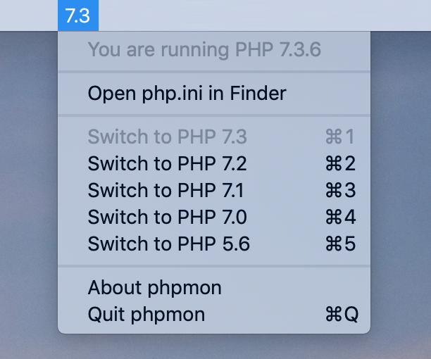

# phpmon

This version of phpmon was developed on and is for **macOS Mojave** with a working Homebrew installation and Laravel Valet 2.2.

phpmon is a macOS utility that runs on your Mac and displays the active PHP version in your status bar. Handy if you're running multiple versions of PHP with Homebrew and wish to see which version is currently linked & active with Laravel Valet.

## How it works

### Version detection

This utility runs `php -r 'print phpversion();'` in the background periodically and extracts the version number.

### Switching PHP versions

This utility will detect which PHP versions you have installed via Homebrew, and then allows you to switch between them.

This means:

- You have at least the latest version of PHP installed (`php@7.3`)
- You have installed Laravel Valet (`which valet` returns `/usr/local/bin/valet`)
- You ran `valet trust`, which means Valet commands can be run without using sudo

The utility runs the following commands:

- Unlink all detected PHP versions
- Switch to PHP 7.3 (this is done in order to ensure that Valet works, even when attempting to use PHP 5.6)
- Tell Valet to switch to a specific PHP version
- Link the desired version of PHP

If you want to know more about how this works, you can find the file Services.swift under the Helpers directory to learn more about how switching PHP versions works. In the end, this just executes some shell commands.
