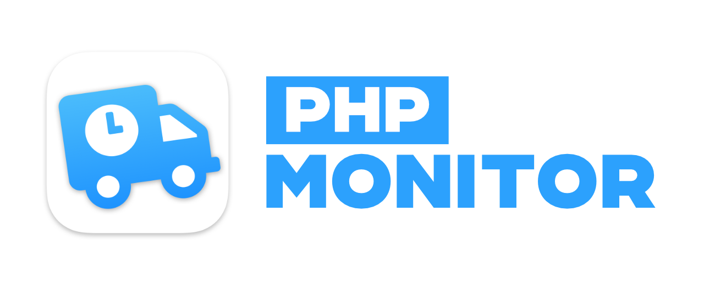

> If this software has been useful to you, I ask that you **please star the repository**, that way I know that the software is being used. Also, please consider leaving [a one-time donation](https://nicoverbruggen.be/sponsor) to support the project, as this is something I make in my free time. **Thank you!** ⭐️

<p align="center"></p>

**PHP Monitor** (or *phpmon*) is a lightweight macOS utility app that runs on your Mac and displays the active PHP version in your status bar. It's tightly integrated with [Laravel Valet](https://github.com/laravel/valet), so <u>you need to have it set up before you can use this app</u> (consult the FAQ below with info about how to set up your environment).


<small><i>Screenshot: Showing the key functionality of PHP Monitor.</i></small>

It's super convenient to switch between different versions of PHP. You'll even get notifications (only if you choose to opt-in, of course)!


PHP Monitor also gives you quick access to various useful functionality (like accessing configuration files, restarting services, and more).

You can also add new domains as links, isolate sites, manage various services, and perform First Aid to fix all kinds of common PHP link issues.

## 🖥 System requirements

PHP Monitor is a universal application that runs natively on Apple Silicon **and** Intel-based Macs.

* Your user account can administer your computer (required for some functionality, e.g. certificate generation)
* macOS 11 Big Sur or later
* Homebrew is installed in `/usr/local/homebrew` or `/opt/homebrew`
* Homebrew `php` formula is installed
* Laravel Valet 3 recommended (but compatible with Valet 2)

_You may need to update your Valet installation to keep everything working if a major version update of PHP has been released. You can do this by running `composer global update && valet install`. Some features are not supported when running Valet 2._

## 🚀 How to install

Again, make sure you have **Laravel Valet** installed first. Once that's done, you can install via Homebrew (recommended), or may download the latest release on GitHub.

To install via Homebrew, run:

	brew tap nicoverbruggen/homebrew-cask
	brew install --cask phpmon

To upgrade your existing installation, run:

	brew upgrade phpmon

(You may need to run `brew update` or `brew update-reset` first in order to update the cask file if you ran a Homebrew operation recently.)

## ⚡️ Launchers (Alfred, Raycast)

If you would like to integrate with your launcher of choice, you can also download an [Alfred workflow](https://github.com/nicoverbruggen/phpmon/raw/main/integrations/phpmon.alfredworkflow) or [Raycast extension](https://www.raycast.com/nicoverbruggen/php-monitor) that works with PHP Monitor.

The app must be running in the background for these to work, and the _Allow third-party integrations_ checkbox must be enabled in Preferences (it is by default).

## 🔑 Is the app signed & notarized?

Yes, the app is signed and notarized, meaning all you have to do is approve its first launch (or whenever it updates).

## 👨‍💻 Why build this?

I wanted to be able to **see at a glance** which version of PHP was linked, and handle dealing with Laravel Valet in a simple app without having to deal with the terminal every time. 

Initially, I had an Alfred workflow for this — but it has now been replaced with this utility, which also does a good job at displaying additional information at a glance, like the current PHP version, memory limits, and more.

## 🤬 The app won't start?!

PHP Monitor performs some integrity checks to ensure a good experience when using the app. You'll get a message telling you that PHP Monitor won't work correctly in a variety of scenarios.

**Follow instructions as specified in the alert in order to resolve any issues.**

(If the app crashes at launch without showing you any of these messages, you might have a non-standard Homebrew and Valet setup. Those are not supported.)

## 🙋‍♂️ FAQ & Troubleshooting

> If you are having issues, the first thing you should be doing is installing the latest version of PHP Monitor _and_ Laravel Valet. This can resolve a variety of issues. To upgrade Valet, run `composer global update`. Don't forget to run `valet install` after upgrading.

If you're still having issues, here's a few common questions & answers, as well as issues and solutions:

<details>
<summary><strong>Which versions of PHP are supported?</strong></summary>

<ul>
<li>PHP 5.6 (only if you are running Valet 2)</li>
<li>PHP 7.0</li>
<li>PHP 7.1</li>
<li>PHP 7.2</li>
<li>PHP 7.3</li>
<li>PHP 7.4</li>
<li>PHP 8.0</li>
<li>PHP 8.1</li>
<li>PHP 8.2 (experimental)</li>
</ul>

For more details, consult the [constants file](https://github.com/nicoverbruggen/phpmon/blob/main/phpmon/Common/Core/Constants.swift#L16) file to see which versions are supported.

</details>

<details>
<summary><strong>I want PHP Monitor to start up when I boot my Mac!</strong></summary>

You can do this by dragging *PHP Monitor.app* into the **Login Items** section in **System Preferences > Users & Groups** for your account.

Super convenient!
</details>

<details>
<summary><strong>I want to set up PHP Monitor from scratch! I don't have Homebrew installed either, where do I begin?</strong></summary>

If you want to set up your computer for the very first time with PHP Monitor, here's how I do it.

**I have also created [a video tutorial](https://www.youtube.com/watch?v=fO3hVhkvm3w) which may be easier to follow. If you just want the terminal commands, keep reading.**

Install [Homebrew](https://brew.sh) first. Follow the instructions there first!

Then, you'll need to set up your PATH. 

    nano .zshrc

Make sure the following line is not in the comments:

    # on an Intel Mac
    export PATH=$HOME/bin:/usr/local/bin:$PATH

If you're on an Apple Silicon-based Mac, you'll need to add: 

    # on an M1 Mac
    export PATH=$HOME/bin:/opt/homebrew/bin:$PATH

and add the following to your `.zshrc` file, but add this BEFORE the homebrew PATH additions:

    export PATH=$HOME/bin:~/.composer/vendor/bin:$PATH
    
If you're adding `composer` and Homebrew binaries, ensure that Homebrew binaries are preferred by adding these to the path last. On my system, that looks like this:

    export PATH=$HOME/bin:/usr/local/bin:$PATH
    export PATH=$HOME/bin:~/.composer/vendor/bin:$PATH
    export PATH=$HOME/bin:/opt/homebrew/bin:$PATH

If you are *not* on Apple Silicon, you should remove the third line.

Install the `php` and `composer` formulae:

    brew install php composer

Make sure PHP is linked correctly:

    which php

should return: `/usr/local/bin/php` (or `/opt/homebrew/bin/php` if you are on Apple Silicon)

    composer global require laravel/valet
    
For optimal results, you should lock your PHP platform for global dependencies to the oldest version of PHP you intend to run. If that version is PHP 7.0, your `~/.composer/composer.json` file could look like this (please adjust the version accordingly!):

```
{
    "require": {
        "laravel/valet": "^3.0",
    },
    "config": {
        "platform": {
            "php": "7.0"
        }
    }
}
```

Run `composer global update` again. This ensures that when you switch to a different global PHP version, [Valet won't break](https://github.com/nicoverbruggen/phpmon/issues/178). If it does, PHP Monitor will let you know what you can do about this.

Then, install Valet:
    
    valet install

This should install `dnsmasq` and set up Valet. Great, almost there!

    valet trust

You can now install PHP Monitor, if you haven't already:

    brew tap nicoverbruggen/homebrew-cask
	brew install --cask phpmon

Finally, run PHP Monitor. Since the app is notarized and signed with a developer ID, it should work. You will need to approve the initial launch of the app, but you should be ready to go now.
</details>

<details>
<summary><strong>How frequently does PHP Monitor check for updates?</strong></summary>

PHP Monitor will check if an update is available every time you start the app.

You can disable this behaviour by going to Preferences (via the PHP Monitor icon in the menu bar) and unchecking "Automatically check for updates". You can always check for updates manually.

</details>

<details>
<summary><strong>I have PHP Monitor installed, and it works. I want to upgrade my PHP installations to the latest version, what's the best way to do this?</strong></summary>

It's easy to make a mistake here, and end up with an unlinked version of PHP or have versions missing from PHP Monitor.

Here's what I usually do:

* Open PHP Monitor and select **First Aid & Services** > **Restore Homebrew Permissions**.
* Close PHP Monitor after the pop-up tells you the permissions were restored.
* Run `brew update-reset`
* Run `brew upgrade`

If after this, any PHP versions are missing in PHP Monitor, please run the following for the versions that are missing:

* Run `brew uninstall php@x.x` (where `x.x` is the version)
* Run `brew cleanup` (if you get any permission issues you may need to manually clean up the folder)
* Run `brew install php@x.x` (where `x.x` is the version)

You may still need to run `brew link php` after upgrading, too.

That's it. Now start up PHP Monitor again and you should be golden!
</details>

<details>
<summary><strong>PHP Monitor tells me `php` is not installed...</strong></summary>

Try installing again using `brew install php`. 

This should resolve the issue! If that does not fix the issue, run `brew link php --force`. (Afterwards, you may need to restart your terminal to make sure the new linked version is detected.)

	brew install php
	brew link php --force
	
</details>

<details>
<summary><strong>Valet sites won't load. I'm getting a 502 Bad Gateway error!</strong></summary>

If you're visiting your `.test` domain, and you're getting a 502 (Bad Gateway) after switching to a different PHP version, you're dealing with a common issue.

This problem is usually resolved by upgrading Valet and running `valet install` again.

	composer global update
	valet install

</details>

<details>
<summary><strong>PHP Monitor tells me my installation is broken, but I don't see why!</strong></summary>

PHP Monitor tells you that a PHP installation is broken, if the configuration is causing warnings or errors when determining the version number.

Since PHP Monitor changes the linked version via Homebrew, both Valet *and* your terminal (CLI) should use the new PHP version.

However, this might not be the case on your system. You _might_ have a specific version of PHP linked if that is not the case. In that case, you may need to change your `.bashrc` or `.zshrc` file where the PATH is set (depending on the terminal you use).

You can find out which version of PHP is being used by running `which php`.

You can find out what exactly is causing the issue by running a command. On Intel, you can run (replace `7.4` with the version that is broken):

```
/usr/local/opt/php@7.4/bin/php -r "print phpversion();"
```

On Apple Silicon, you can run (replace `7.4` with the version that is broken):

```
/opt/homebrew/opt/php@7.4/bin/php -r "print phpversion();"
```

You should see an error or a warning here in the output. 

Usually this is a duplicate extension declaration causing issues, or an extension that couldn't be loaded. You'll have to solve that issue yourself (usually by removing the offending extension or reinstalling).

</details>

<details>
<summary><strong>The option to isolate a site is disabled! What's going on?</strong></summary>

Make sure you have at least **Valet 3.0** installed, since support for isolation was added in this version of Valet. (Please note that this version of Valet drops support for PHP 5.6.)
</details>
	
<details>
<summary><strong>One of the limits (memory limit, max POST size, max upload size) shows an exclamation mark!</strong></summary>

The value you provided in your INI file is invalid. If that is the case, PHP will attempt to parse your value as bytes, which is usually unintended. (`1GB` will resolve to merely a few bytes, and all of your applications will run out of memory!)

You must a provide a value like so: `1024K`, `256M`, `1G`. Alternatively, `-1` is also allowed, or just an integer (which will result in N amount of bytes being the limit).

**Example**: Trying to use `1GB` as the memory limit, for example, will result in this exclamation mark. The correct way to set a 1GB limit is by using `1G` as the value. (Note: The displayed value will append `B` for clarity, so if you set `1G`, the value reported by PHP Monitor will be 1 GB.)

</details>

<details>
<summary><strong>One of my commented out extensions is not being detected...</strong></summary>

The app searches in the relevant `.ini` files for a specific pattern. For regular extensions:

* `extension="*.so"`
* `; extension="*.so"`

For Zend extensions:

* `zend_extension="*.so"`
* `; zend_extension="*.so"`

The `*` is a wildcard and the name of the extension. If you've commented out the extension, make sure you've commented it out with a semicolon (;) and a single space after the semicolon for PHP Monitor to detect it.

Since v3.4 all of the loaded .ini files are sourced to determine which extensions are enabled.

</details>

<details>
<summary><strong>I've got two Homebrew installations on my Apple Silicon Mac, can I choose which installation to use with PHP Monitor?</strong></summary>

If you are using PHP Monitor on an Intel machine or on an Apple Silicon machine with Rosetta enabled, PHP Monitor expects the main Homebrew binary in `/usr/local/bin/brew`.

If you are using PHP Monitor on Apple Silicon without Rosetta, PHP Monitor expects the main Homebrew binary in `/opt/homebrew/bin/brew`.

If there's an issue here, you'll get an alert at launch.

Make sure that the version of Homebrew that you are running normally is the same as the one that PHP Monitor expects. If you are on M1 hardware for example, but still using Rosetta for Homebrew, you'll need to run PHP Monitor under Rosetta as well. 

PHP Monitor is a universal app and supports both architectures, so [find out here](https://support.apple.com/en-us/HT211861) how to enable Rosetta with PHP Monitor.
</details>

<details>
<summary><strong>Why is the app doing network requests?</strong></summary>

The app will automatically check for updates, which is the most likely culprit. 

This happens at launch (unless disabled), and the app directly checks the Caskfile hosted on GitHub. This data is not, and will not be used for analytics (and, as far as I can tell, cannot).

I also can't prevent `brew` from doing things via the network when PHP Monitor uses the binary.

The app includes an Internet Access Policy file, so if you're using something like Little Snitch there should be a description why these calls occur.

</details>

<details>
<summary><strong>How do I various presets to show up?</strong></summary>

You must set these presets up in a JSON file, located in `~/.config/phpmon/config.json`. 

You must have set up at least one valid preset for this presets to work in PHP Monitor.

Here's an example of a working preset:

<pre>
{
    "scan_apps": [],
    "services": [],
    "presets": [
        {
            "name": "Legacy Project",
            "php": "8.0",
            "extensions": {
                "xdebug": false
            },
            "configuration": {
                "memory_limit": "128M",
                "upload_max_filesize": "128M",
                "post_max_size": "128M"
            }
        }
    ],
    "export": {}
}
</pre>

You can omit the `php` key in the preset if you do not wish for the preset to switch to a given PHP version.
</details>

<details>
<summary><strong>How do I ensure additional Homebrew services are shown in the app?</strong></summary>

You must set these services up in a JSON file, located in `~/.config/phpmon/config.json`. 

You can specify custom services in the configuration file for Homebrew services that run as your own user (not root). 

You can find out which services are available by running `brew services list`. 

Here's an example where we add the `mailgun` and `mysql` services to PHP Monitor:

<pre>
{
    "scan_apps": [],
    "services": ["mailgun", "mysql"],
    "presets": [],
    "export": {}
}
</pre>
</details>

<details>
<summary><strong>How do I set custom environment variables?</strong></summary>

You must configure these custom environment variables up in a JSON file, located in `~/.config/phpmon/config.json`. 

PHP Monitor uses a default Shell environment, with no custom environment variables. You need to set custom environment variables manually. These are then used for e.g. Composer.

Here's an example of a working `COMPOSER_HOME` environment variable which is respected:

<pre>
{
    "scan_apps": [],
    "services": [],
    "presets": [],
    "export": {
        "COMPOSER_HOME": "/absolute/path/to/composer/folder"
    }
}
</pre>
</details>

<details>
<summary><strong>How do I get various applications to show up in the domain list's right-click menu?</strong></summary>

When you select and right-click on a domain, you can open these directories with various applications. This can help speed up your workflow. However, for these apps to show up, they must be detected first.

The supported apps are: <i>PhpStorm, Visual Studio Code, Sublime Text, Sublime Merge, iTerm</i>.

All of these apps should just be detected correctly, no matter their location on your system. If you can open it using `open -a "appname"`, the app should be detected and work. If you have renamed the app, there might be an issue getting it detected.

To see which files are checked to determine availability, see [this file](./phpmon/Domain/Helpers/Application.swift).

You can add your own apps by creating and editing a `~/.config/phpmon/config.json` file, and make sure the `scan_apps` key is set:

<pre>
{
    "scan_apps": ["Xcode", "Kraken"]
}
</pre>

You can put as many apps as you'd like in the `scan_apps` array, and PHP Monitor will check for the existence of these apps. You do not need to set the full path, just the name of the app should work. Not all apps support opening a folder, though, so your success might vary.
</details>

<details>
<summary><strong>How can the app integrate with third party tools, like Alfred or Raycast?</strong></summary>

PHP Monitor supports third party app integrations by default, and this feature is enabled in Preferences unless you disable it.

You can grab the official [Alfred workflow](https://github.com/nicoverbruggen/phpmon/raw/main/integrations/phpmon.alfredworkflow) or [Raycast extension](https://www.raycast.com/nicoverbruggen/php-monitor).

If you'd like to integrate something yourself, all you need to to is use the `phpmon://` protocol and ensure that third party app integrations are enabled in Preferences (in PHP Monitor).

Using app callbacks, macOS and PHP Monitor allow for the following to be called:

* phpmon://list
* phpmon://services/stop
* phpmon://services/restart/all
* phpmon://services/restart/nginx
* phpmon://services/restart/php
* phpmon://services/restart/dnsmasq
* phpmon://locate/config
* phpmon://locate/composer
* phpmon://locate/valet
* phpmon://phpinfo
* phpmon://switch/php/{version}

</details>

<details>
<summary><strong>How does the app know what PHP version is required for my app?</strong></summary>

The `composer.json` file in the root of the folder (if it exists) is scanned and interpreted.

If the version is set in `platform`, it takes precendence.
If the version is not set in `platform` but it is in `require` (most common) then that version is used.
</details>

<details>
<summary><strong>What do the checkmarks next to the PHP version mean in the site list?</strong></summary>

You'll see a checkmark next to the version number if the currently enabled PHP version is compatible with the version required to run the site. 

This is determined by evaluating the PHP requirement constraint (e.g. `^8.0`, `~8.0` or a specific version: `8.0`).
</details>

<details>
<summary><strong>Why can't I see the driver type any more? It says "Project Type" now.</strong></summary>

PHP Monitor currently checks your `composer.json` file to try to figure out what project you are running. 

This approach is a lot faster than asking for a driver when you have many sites linked, but is slightly less reliable since the framework or type of project inferred via `composer.json` might not be 100% accurate.

You can always still ask Valet using the command line, should it be necessary. In my experience fetching the drivers slowed down the app unnecessarily.

</details>

<details>
<summary><strong>After running PHP Monitor, Homebrew sometimes has issues with `brew upgrade` or `brew cleanup`!</strong></summary>

You can now use **First Aid & Services > Restore Homebrew Permissions** to (temporarily) resolve this issue and allow for a clean and painless `brew upgrade` or `brew cleanup` process.

If you would like to know more, consult [this issue](https://github.com/nicoverbruggen/phpmon/issues/85) for more information about why this is needed.

</details>

<details>
<summary><strong>The app has crashed!</strong></summary>

Please get in touch and open an issue. PHP Monitor shouldn't crash... (unless you are actually removing PHP *while* the app is running, that’s considered normal behaviour!)

If you would like to report a crash, please include the associated **log files** so I can find out what exactly went wrong.

To find the logs, take a look in `~/Library/Logs/DiagnosticReports` (in Finder) and see if there's any (log) files that start with "PHP Monitor".

</details>

## 📝 Having another issue?

I did not include any tracking or analytics software, so if you encounter issues, let me know [via an issue](https://github.com/nicoverbruggen/phpmon/issues/new).

## 💵 Support me?

PHP Monitor is available entirely **free of charge**, but if you can afford it a donation helps keep the project alive and the app maintained.

You can find a [sponsor](https://nicoverbruggen.be/sponsor) link at the top of this repo or you could click the link here to be taken to my sponsorship page.

Donations really help with the Apple Developer Program cost, and keep me motivated to keep working on PHP Monitor outside of work hours (I do have a day job!).

## 😎 Acknowledgements

Special thanks go out to:

* Everyone supporting me via [GitHub Sponsors](https://github.com/sponsors/nicoverbruggen)
* Everyone who has donated via [my sponsor page](https://nicoverbruggen.be/sponsor)
* The [Homebrew](https://brew.sh/) team & [Valet maintainers](https://github.com/laravel/valet/graphs/contributors)
* Various folks who [reached](https://twitter.com/stauffermatt) [out](https://twitter.com/marcelpociot) when PHP Monitor was still very much a small app with a handful of stars or so
* Everyone who has left feedback and reported bugs
* Everyone in the Laravel community who shared the app, especially on Twitter

Thank you very much for your contributions, kind words and support.

## 🚜 How it works

### Loading info about PHP in the background

This utility runs `php-config --version` in the background periodically. It also checks your `.ini` files for extensions and loads more information about your limits (memory limit, POST limit, upload limit). 

In order to save power, this only happens once every 60 seconds.

### Switching PHP versions

This utility will detect which PHP versions you have installed via Homebrew, and then allows you to switch between them.

The switcher will disable all PHP-FPM services not belonging to the version you wish to use, and link the desired version of PHP. Then, it'll restart your desired PHP version's FPM process. This all happens in parallel, so this should be a bit faster than Valet’s switcher.

If you're using Valet 3, versions of PHP-FPM required to keep isolated sites up and running will also be started or stopped as needed.

### Config change detection

PHP Monitor watches your filesystem in the relevant `conf.d` directory for the currently linked PHP version. 

Whenever an .ini file is modified, PHP Monitor will attempt to reload the current information about the active PHP installation. 

If an extension or other process writes to a single file a bunch of times in a short span of time (&lt; 1 sec), PHP Monitor will only reload the active configuration information after a while (with a slight delay).

### Site detection

1. **Location of your sites**: PHP Monitor uses the Valet configuration file to determine which folders to look into. Each folder is scanned and then PHP Monitor will validate if a composer.json file exists to determine the desired PHP version.
1. **Sites secured or not secured**: Whether the directory has been secured is determined by checking if a matching certificate exists under Valet's `Certificates` directory for that site name.
1. **Project type**: PHP Monitor checks your `composer.json` file for "notable dependencies". If you have `laravel/framework` in your `require`, there's a good chance the project type is `Laravel`, after all.

*Note*: If you have linked a folder in Documents, Desktop or Downloads you might need to grant PHP Monitor access to those directories for PHP Monitor to work correctly.

### Want to know more?

If you want to know more about how this works, I recommend you check out the source code.

I have done my best to annotate as much as humanly possible, and have avoided using an overly complicated architecture to keep the code as easy to maintain as possible. The code isn't perfect by a long shot (lots of cleanup can still happen!) but the application works well.

I also have a few tests for key parts of the application that I found needed to be tested. In the future, I would like to add even more tests for some of the UI stuff, but for now the tests are more unit tests than feature tests.

For more detailed information for developers, please see [the documentation file for developers](./DEVELOPER.md).
