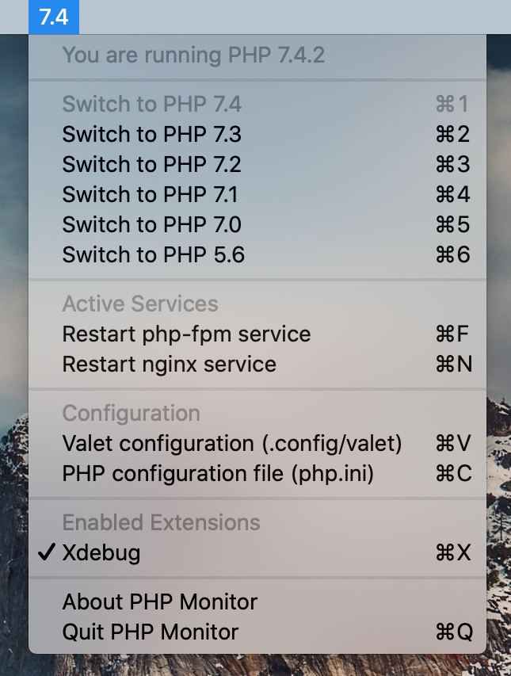

# PHP Monitor

PHP Monitor (or phpmon) is a lightweight macOS utility app that runs on your Mac and displays the active PHP version in your status bar.

It also gives you quick access to various useful functionality (like switching PHP versions, restarting services, accessing configuration files, and more).

For me, it comes in handy when running multiple versions of PHP with Homebrew. If you wish to be able to see at a glance which version is currently linked & active with Laravel Valet, PHP Monitor is your new best friend. 

It's also super convenient to switch between different versions of PHP, or to find your currently active .ini file!

## 🖥 System requirements

* macOS 10.15 Catalina or higher (works on macOS 11 Big Sur)
* PHP 7.4 installed with Homebrew 2.x
* Laravel Valet 2.x

_Please note that future versions of PHP will not work automatically, minor changes are required to add support for newer versions of PHP._

## 🚀 How to install

You can install via Homebrew, or may download the latest [release][1].

To install via Homebrew, run:

	brew tap nicoverbruggen/homebrew-cask
	brew cask install phpmon

_The app is signed and notarized, meaning all you have to do is approve its first launch._

## 👨‍💻 Why I built this

I wanted to be able to see at a glance which version of PHP was linked, and handle dealing with Laravel Valet in a simple app without having to deal with the terminal every time. 

Initially, I had an Alfred workflow for this. But this does the job as well, while also showing me at all times which version of PHP is linked (which is the main benefit over e.g. an Alfred workflow).

## 🚜 How it works

### Version detection

This utility runs `php -r 'print phpversion()'` in the background periodically (every 60 seconds).

### Switching PHP versions

This utility will detect which PHP versions you have installed via Homebrew, and then allows you to switch between them.

This means:

- You have at least the latest version of PHP installed (`php@7.4`)
- You have installed Laravel Valet (`which valet` returns `/usr/local/bin/valet`)
- You ran `valet trust`, which means Valet commands can be run without using sudo

The utility runs the following commands:

- Unlink all detected PHP versions
- Switch to PHP 7.4 (this is done to ensure that Valet works, even when attempting to use PHP 5.6)
- Stop all php-fpm service instances
- Link the desired version of PHP
- Start the correct php-fpm service for the desired PHP version

### Want to know more?

If you want to know more about how this works, I recommend you check out the source code. 

This app isn't very complicated after all. In the end, this just (conveniently) executes some shell commands.

## 🤬 Troubleshooting

**If you are having issues, the first thing you should be doing is installing the latest version of PHP Monitor. This can resolve a variety of issues.**

PHP Monitor performs some integrity checks to ensure a good experience when using the app. You'll get a message telling you that PHP Monitor won't work correctly in the following scenarios:

- The PHP binary is not located in `/usr/local/bin/php`
- PHP 7.4 is missing in `/usr/local/opt`
- Laravel Valet is missing in `/usr/local/bin/valet`
- Brew has not been added to sudoers in `/private/etc/sudoers.d/brew`
- Valet has not been added to sudoers in `/private/etc/sudoers.d/valet`
- Multiple PHP services are active (see more info below)

Follow instructions as specified in the alert in order to resolve any issues.

## 📝 Additional information

Please consult the [additional information][2] file that contains more information.

## ⭐️ Star me!

If this software has been useful to you, I ask that you **please star the repository**, so I know that the software is being used.

I did not include any tracking or analytics software, so if you encounter issues, let me know [via an issue](https://github.com/nicoverbruggen/phpmon/issues/new).

## 💵 Support me?

I develop this application in my spare time, after work. If you find the application useful and you have a bit of money to spare, feel free to send me [a tip via PayPal][3]. 

[1]:	https://github.com/nicoverbruggen/phpmon/releases
[2]:	docs/ADDITIONAL.md
[3]:	https://paypal.me/nicoverbruggen
