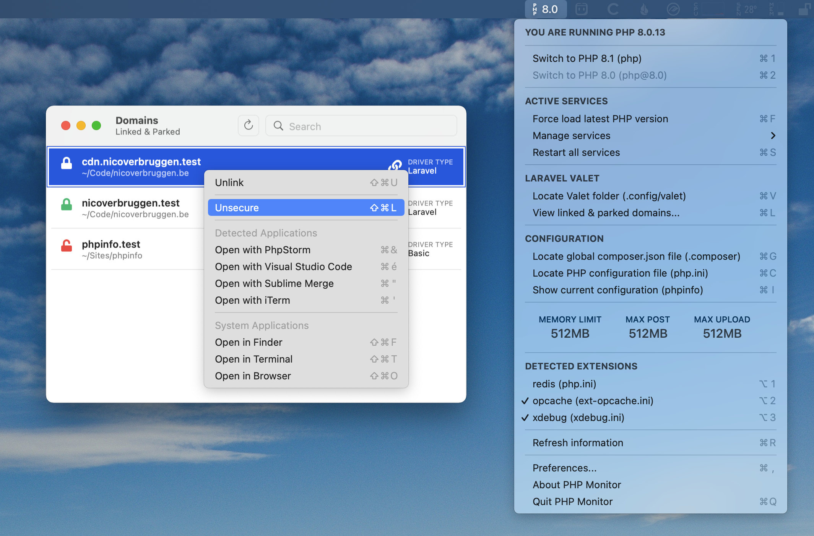
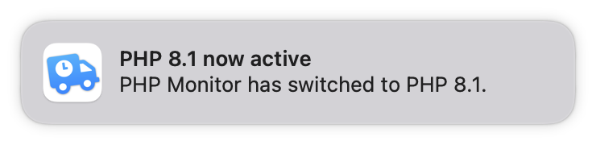
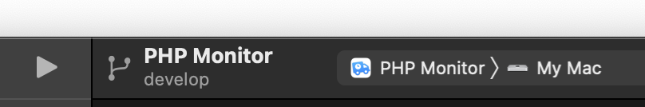

# PHP Monitor

> If this software has been useful to you, I ask that you **please star the repository**, that way I know that the software is being used. Also, please consider leaving [a one-time donation](https://nicoverbruggen.be/sponsor) to support the project.
> You can also send me [feedback](https://twitter.com/nicoverbruggen) if the app came in handy.<br>**Thank you!** ⭐️


**PHP Monitor** (or phpmon) is a lightweight macOS utility app that runs on your Mac and displays the active PHP version in your status bar. It's tightly integrated with [Laravel Valet](https://github.com/laravel/valet), so you need to have it set up before you can use this.



<small><i>Screenshot: A menu showing all of the functionality of PHP Monitor.</i></small>

It's super convenient to switch between different versions of PHP. You'll even get notifications (only if you choose to opt-in, of course)!



PHP Monitor also gives you quick access to various useful functionality (like accessing configuration files, restarting services, and more).

## 🖥 System requirements

PHP Monitor is a universal application that runs on Apple Silicon **and** Intel-based Macs.

* macOS 11 Big Sur or higher (supports macOS 12 Monterey)
* Homebrew is installed in `/usr/local/homebrew` or `/opt/homebrew`
* The brew formula `php` has to be installed (which version is detected)
* Laravel Valet 2.13 or higher

_You may need to update your Valet installation to keep everything working if a major version update of PHP has been released._

## 🚀 How to install

You can install via Homebrew (recommended), or may download the latest release on GitHub.

To install via Homebrew, run:

	brew tap nicoverbruggen/homebrew-cask
	brew install --cask phpmon

To upgrade your existing installation, run:

	brew upgrade phpmon

_The app is signed and notarized, meaning all you have to do is approve its first launch._

## 👨‍💻 Why build this?

I wanted to be able to **see at a glance** which version of PHP was linked, and handle dealing with Laravel Valet in a simple app without having to deal with the terminal every time. 

Initially, I had an Alfred workflow for this — but it has now been replaced with this utility, which also does a good job at displaying additional information at a glance, like the current PHP version, memory limits, and more.

## 🤬 The app won't start?!

PHP Monitor performs some integrity checks to ensure a good experience when using the app. You'll get a message telling you that PHP Monitor won't work correctly in a variety of scenarios. 

**Follow instructions as specified in the alert in order to resolve any issues.**

## 🙋‍♂️ FAQ & Troubleshooting

> If you are having issues, the first thing you should be doing is installing the latest version of PHP Monitor _and_ Laravel Valet. This can resolve a variety of issues. To upgrade Valet, run `composer global update`. Don't forget to run `valet install` after upgrading.

If you're still having issues, here's a few common questions & answers, as well as issues and solutions:

<details>
<summary><strong>Which versions of PHP are supported?</strong></summary>

<ul>
<li>PHP 5.6</li>
<li>PHP 7.0</li>
<li>PHP 7.1</li>
<li>PHP 7.2</li>
<li>PHP 7.3</li>
<li>PHP 7.4</li>
<li>PHP 8.0</li>
<li>PHP 8.1</li>
<li>PHP 8.2 (experimental)</li>
</ul>

For more details, consult the [constants file](https://github.com/nicoverbruggen/phpmon/blob/main/phpmon/Constants.swift#L16) file to see which versions are supported.

</details>

<details>
<summary><strong>I want PHP Monitor to start up when I boot my Mac!</strong></summary>

You can do this by dragging *PHP Monitor.app* into the **Login Items** section in **System Preferences > Users & Groups** for your account.

Super convenient!
</details>

<details>
<summary><strong>I want to set up PHP Monitor from scratch! I don't have Homebrew installed either, where do I begin?</strong></summary>

If you want to set up your computer for the very first time with PHP Monitor, here's how I do it:

Install [Homebrew](https://brew.sh) first.

Install PHP, composer, add to path:

    brew install php
    brew install composer
    nano .zshrc

Make sure the following line is not in the comments:

    # on an Intel Mac
    export PATH=$HOME/bin:/usr/local/bin:$PATH

If you're on an Apple Silicon-based Mac, you'll need to add: 

    # on an M1 Mac
    export PATH=$HOME/bin:/opt/homebrew/bin:$PATH

and add the following to your .zshrc:

    export PATH=$HOME/bin:~/.composer/vendor/bin:$PATH

Make sure PHP is linked correctly:

    which php

should return: `/usr/local/bin/php` (or `/opt/homebrew/bin/php`)

    composer global require laravel/valet
    valet install

This should install `dnsmasq` and set up Valet. Great, almost there!

    valet trust

Finally, run PHP Monitor. Since the app is notarized and signed with a developer ID, it should work.
</details>

<details>
<summary><strong>PHP Monitor tells me `php` is not installed...</strong></summary>

Try installing again using `brew install php`. 

This should resolve the issue! If that does not fix the issue, run `brew link php --force`. (Afterwards, you may need to restart your terminal to make sure the new linked version is detected.)

	brew install php
	brew link php --force
	
</details>

<details>
<summary><strong>Valet sites won't load. I'm getting a 502 Bad Gateway error!</strong></summary>

If you're visiting your `.test` domain, and you're getting a 502 (Bad Gateway) after switching to a different PHP version, you're dealing with a common issue.

This problem is usually resolved by upgrading Valet and running `valet install` again.

	composer global update
	valet install

</details>

<details>
<summary><strong>PHP Monitor tells me my installation is broken, but I don't see why!</strong></summary>

PHP Monitor tells you that a PHP installation is broken, if the configuration is causing warnings or errors when determining the version number.

Since PHP Monitor changes the linked version via Homebrew, both Valet *and* your terminal (CLI) should use the new PHP version.

However, this might not be the case on your system. You _might_ have a specific version of PHP linked if that is not the case. In that case, you may need to change your `.bashrc` or `.zshrc` file where the PATH is set (depending on the terminal you use).

You can find out which version of PHP is being used by running `which php`.

You can find out what exactly is causing the issue by running a command. On Intel, you can run (replace `7.4` with the version that is broken):

```
/usr/local/opt/php@7.4/bin/php -r "print phpversion();"
```

On Apple Silicon, you can run (replace `7.4` with the version that is broken):

```
/opt/homebrew/opt/php@7.4/bin/php -r "print phpversion();"
```

You should see an error or a warning here in the output. 

Usually this is a duplicate extension declaration causing issues, or an extension that couldn't be loaded. You'll have to solve that issue yourself (usually by removing the offending extension or reinstalling).

</details>
	
<details>
<summary><strong>One of the limits (memory limit, max POST size, max upload size) shows an exclamation mark!</strong></summary>

The value you provided in your INI file is invalid. If that is the case, PHP will attempt to parse your value as bytes, which is usually unintended. (`1GB` will resolve to merely a few bytes, and all of your applications will run out of memory!)

You must a provide a value like so: `1024K`, `256M`, `1G`. Alternatively, `-1` is also allowed, or just an integer (which will result in N amount of bytes being the limit).

**Example**: Trying to use `1GB` as the memory limit, for example, will result in this exclamation mark. The correct way to set a 1GB limit is by using `1G` as the value. (Note: The displayed value will append `B` for clarity, so if you set `1G`, the value reported by PHP Monitor will be 1 GB.)

</details>

<details>
<summary><strong>One of my commented out extensions is not being detected...</strong></summary>

The app searches in the relevant `.ini` files for a specific pattern. For regular extensions:

* `extension="*.so"`
* `; extension="*.so"`

For Zend extensions:

* `zend_extension="*.so"`
* `; zend_extension="*.so"`

The `*` is a wildcard and the name of the extension. If you've commented out the extension, make sure you've commented it out with a semicolon (;) and a single space after the semicolon for PHP Monitor to detect it.

Since v3.4 all of the loaded .ini files are sourced to determine which extensions are enabled.

</details>

<details>
<summary><strong>I've got two Homebrew installations on my Apple Silicon Mac, can I choose which installation to use with PHP Monitor?</strong></summary>

Not at this time, no. PHP Monitor will prefer the `/opt/homebrew` installation over the classic installation directory.

</details>

<details>
<summary><strong>Why is the app doing network requests?</strong></summary>

It's Homebrew. I can't prevent `brew` from doing things via the network when I invoke it.

PHP Monitor itself doesn't do any network requests. Feel free to check the source code or intercept the traffic, if you don't believe me.

</details>

<details>
<summary><strong>How do I get various applications to show up in the domain list's right-click menu?</strong></summary>

When you select and right-click on a domain, you can open these directories with various applications. This can help speed up your workflow. However, for these apps to show up, they must be detected first.

The supported apps are: <i>PhpStorm, Visual Studio Code, Sublime Text, Sublime Merge, iTerm</i>.

All of these apps should just be detected correctly, no matter their location on your system. If you can open it using `open -a "appname"`, the app should be detected and work. If you have renamed the app, there might be an issue getting it detected.

To see which files are checked to determine availability, see [this file](./phpmon/Domain/Helpers/Application.swift).
</details>

<details>
<summary><strong>After running PHP Monitor, Homebrew sometimes has issues with `brew upgrade` or `brew cleanup`!</strong></summary>

<strike>This is a security feature of Homebrew. When you start a service as an administrator, the root user becomes the owner of relevant binaries. You will need to manually clean up those folders yourself using `rm -rf` (or by manually removing those folders via Finder).</strike>

**Update**: If you are on PHP Monitor 4.1 (or higher), this problem should no longer be an issue for newly installed or upgraded versions of PHP, since this was fixed in that release. 

For more information on this, see [this issue](https://github.com/nicoverbruggen/phpmon/issues/17) and also [this issue about switching to Valet's switcher](https://github.com/nicoverbruggen/phpmon/issues/34).

</details>

<details>
<summary><strong>The app has crashed!</strong></summary>

Please get in touch and open an issue. PHP Monitor shouldn't crash... (unless you are actually removing PHP *while* the app is running, that’s considered normal behaviour!)

</details>

## 📝 Having another issue?

I did not include any tracking or analytics software, so if you encounter issues, let me know [via an issue](https://github.com/nicoverbruggen/phpmon/issues/new).

## 💵 Support me?

PHP Monitor is available entirely **free of charge**, but if you can afford it a donation helps keep the project alive and the app maintained.

You can find a [sponsor](https://nicoverbruggen.be/sponsor) link at the top of this repo or you could click the link here to be taken to my sponsorship page.

Donations really help with the Apple Developer Program cost, and keep me motivated to keep working on PHP Monitor outside of work hours (I do have a day job!).

## 😎 Acknowledgements

While I did make this application during my own free time, I have been lucky enough to do various experiments during work hours at [DIVE](https://dive.be). I'd also like to shout out the following folks:

* My colleagues at [DIVE](https://dive.be)
* The [Homebrew](https://brew.sh/) team who maintain
* The [developers & maintainers of Valet](https://github.com/laravel/valet/graphs/contributors)
* Everyone in the Laravel community who shared the app (thanks!)
* Various folks who [reached](https://twitter.com/stauffermatt) [out](https://twitter.com/marcelpociot)
* Everyone who left feedback via issues

Thank you very much for your contributions, kind words and support.

## 🚜 How it works

### Loading info about PHP in the background

This utility runs `php-config --version` in the background periodically. It also checks your `.ini` files for extensions and loads more information about your limits (memory limit, POST limit, upload limit). 

In order to save power, this only happens once every 60 seconds.

### Switching PHP versions

This utility will detect which PHP versions you have installed via Homebrew, and then allows you to switch between them.

Starting with PHP Monitor 4.1, the app now leverages Valet’s included `valet use php@major.minor` command.

### Want to know more?

If you want to know more about how this works, I recommend you check out the source code. 

This app isn't very complicated after all. In the end, this just (conveniently) executes some shell commands.

## 🔧 Build instructions



If you'd like to build PHP Monitor yourself, you need:

* Xcode (usually the latest version)
* The contents of this repository

Once you have downloaded this repository, open `PHP Monitor.xcodeproj`, and you should be able to immediately build the app for your system by pressing Cmd-R. This will create a debug build. (If Xcode complains about code signing, you can turn it off.)

If you'd like to create a production build, choose "Any Mac" as the target and select Product > Archive.
